# SafeWorkPay

A decentralized freelancing platform powered by blockchain and AI to ensure secure, transparent, and fair transactions between clients and freelancers.

## Project Information

### Project Name
**SafeWorkPay**

---

### Problem Statement
- Freelancing platforms often face **payment disputes and trust issues**.
- Clients may **withhold funds** even when work is completed.
- Developers may **fail to deliver** after receiving payment.
- These issues **discourage honest participation** and reduce efficiency.
- There’s a **need for a secure, transparent, and fair system** to build trust between clients and freelancers.

---

### Solution Overview
- **SafeWorkPay** is a **decentralized freelancing platform** powered by **blockchain and AI**.
- Clients deposit funds into a **smart contract**, which **holds the money in escrow**.
- **Funds are released** only when **full projects are completed and verified**.
- An **AI model evaluates the submitted code** against project requirements.
- The AI helps in **resolving disputes** fairly by **releasing funds proportionally** (e.g., 50% work = 50% payment).
- Combines the strengths of **blockchain’s trust** and **AI’s analysis**, unlike traditional platforms like Upwork or basic blockchain-based platforms like Ethlance.

---

### Project Description
- Clients can **post projects** and **deposit funds** into smart contracts.
- Developers **bid** on projects and **submit full projects** as they complete work.
- If a dispute arises, an **AI Agent** checks the **completeness of code** based on requirements and completion percentage; funds are released to the developer and remaining to the client.


## 📸 Screenshots

Below are screenshots showcasing different pages and functionalities of **SafeWorkPay**. These images are placeholders from the `public` folder.

---

### 1. 🏠 Homepage

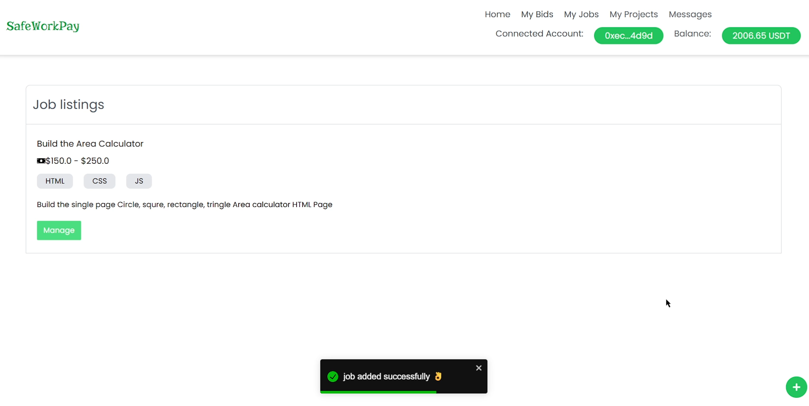

> View the landing page listing all available freelance projects.

---

### 2. 📝 Post a Project

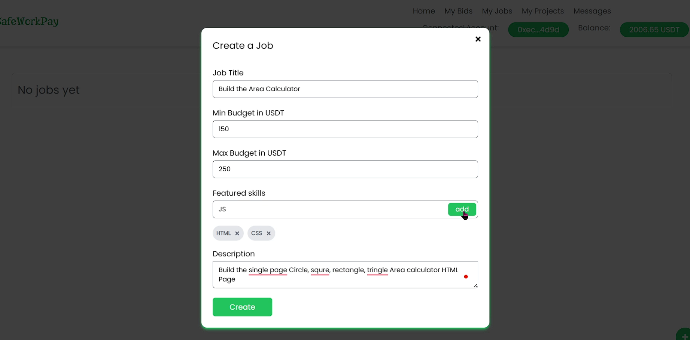

> Clients can post new freelance projects with required details.

---

### 3. 📋 Manage Project

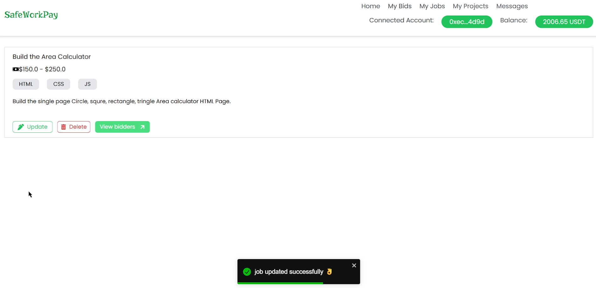

> Track and manage project updates, delete projects, and view bids.

---

### 4. 💼 Bidding Interface

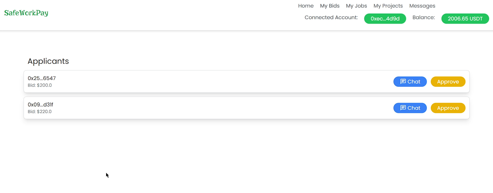

> clients can view bids placed on their projects.

---

### 5. 🧑‍💻 My Job

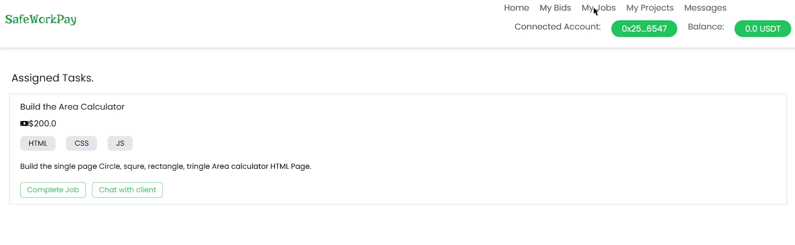

> Freelancers can see all the projects they have assigned.

---

### 6. 📁 My Projects

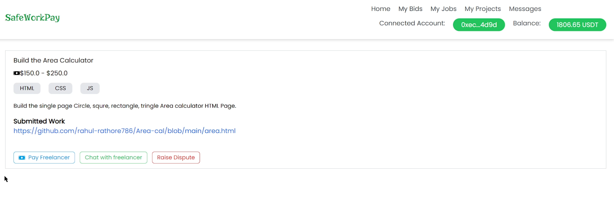

> Clients can see all projects they’ve created and assigned. also pay for the projects and chat with freelancers.

---

### 7. 💬 Messages / Chat

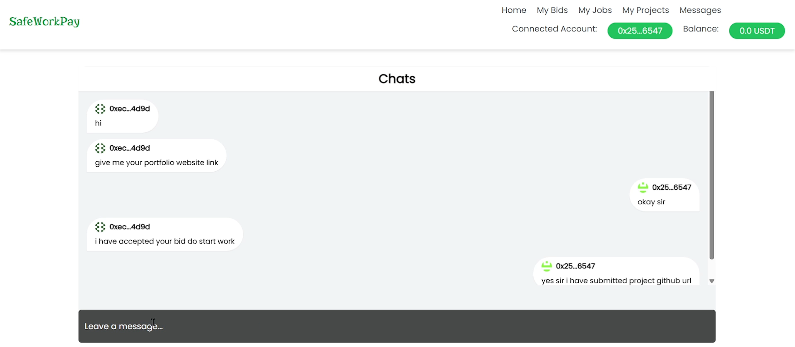

> Real-time communication between clients and freelancers using comet chat.

---

### 8. ⚠️ Dispute Raise

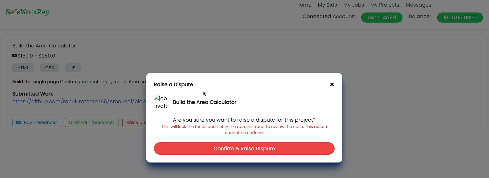

> Raise a dispute if a disagreement arises regarding the project.

---

### 9. 🛠️ Admin Dashboard

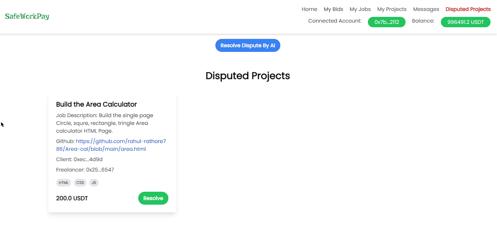

> Admin can monitor and handle disputes from the backend.

---

### 10. 🧑‍⚖️ Dispute Resolve

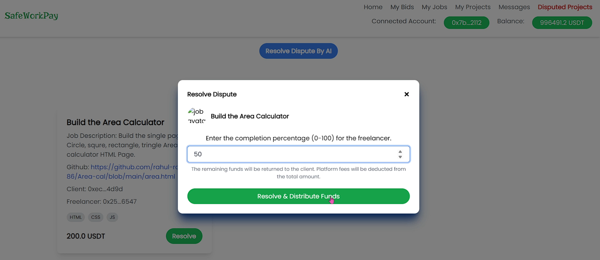

> The system (with AI help) resolves disputes based on task completion and pay amount to freelancers and clients.

---

### 11. ✅ Project Completion

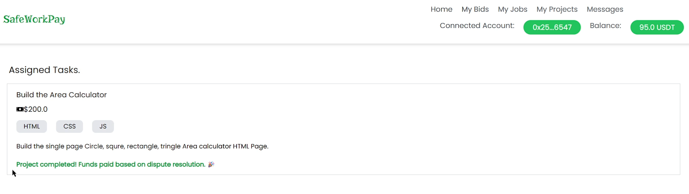

> Freelancers can see all the projects they have completed and payment status of the projects.

---

### 12. 🤖 AI Project Completion Evaluation

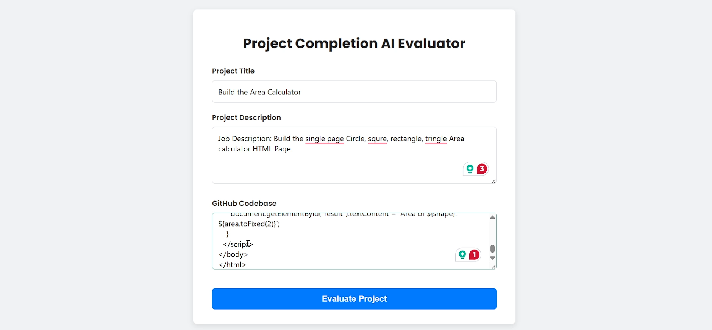

> AI agent evaluates task completion and assists in dispute resolution.

---

## Installation and Running the Frontend

To run the SafeWorkPay frontend, follow these steps:

1. **Install Dependencies**
   ```bash
   yarn
   ```

2. **Start the Frontend**
   ```bash
   yarn start
   ```

**Note**: The smart contracts are already deployed on the Sepolia testnet at the following addresses:
- DappWorks: `0xE9F9bcD880e71FFD32F64D874Fa889c7163CDb7d`
- USDT: `0xb2d7EFb7393fcFCC7C76dcA5da05c8177bA1F6fF`

**Environment Setup**: Make sure to add your MetaMask private key, CometChat credentials, and RPC URL in the `.env` file for the application to function correctly.
#### add the environment variables in the .env file
```
 REACT_APP_COMET_CHAT_APP_ID=
 REACT_APP_COMET_CHAT_AUTH_KEY=
 REACT_APP_COMET_CHAT_REGION=
 REACT_APP_RPC_URL=http://127.0.0.1:8545
 SEPOLIA_RPC_URL=
 PRIVATE_KEY=
 
```

## Running the AI Agent

The AI Agent is a separate component that assists in dispute resolution by evaluating code completeness. To run it:

1. **Frontend Setup for AI Agent**
   - Navigate to the frontend directory:
     ```bash
     cd frontend
     ```
   - Install dependencies:
     ```bash
     yarn
     ```
   - Start the frontend:
     ```bash
     yarn start

 change file name .env.example to .env and add the environment variables in the .env file in frontend directory.

2. **Backend Setup for AI Agent**
   - Navigate to the backend directory of the AI Agent:
     ```bash
     cd backend
     ```
   - Install dependencies:
     ```bash
     yarn
     ```
   - Start the backend server:
     ```bash
     yarn start
     ```

**Note**: Ensure you add your Gemini API key in the appropriate configuration file .env for the AI Agent to work correctly.

## Tools and Technologies Used

- **Frontend**: React, React Router, Tailwind CSS, react-hooks-global-state, ethers.js, react-toastify
- **Backend (Smart Contracts)**: Solidity, Hardhat, OpenZeppelin Contracts
- **Chat Functionality**: CometChat
- **Package Manager**: Yarn
- **Blockchain**: Ethereum (Sepolia Testnet)
- **AI**: Custom AI model for code evaluation and dispute resolution (integrated with Gemini API)

## Additional Notes

- **Security**: The platform uses blockchain for secure escrow and transparent transactions.
- **User Authentication**: Users must connect their MetaMask wallets to interact with the platform.
- **Chat**: Real-time messaging between clients and freelancers is facilitated via CometChat.
- **Dispute Resolution**: A unique feature where AI aids in fair resolution, ensuring partial payments for partial work.

For any issues or contributions, please open an issue or pull request on this repository. We welcome feedback to improve SafeWorkPay!

---

*Built with ❤️ by the SafeWorkPay team*
